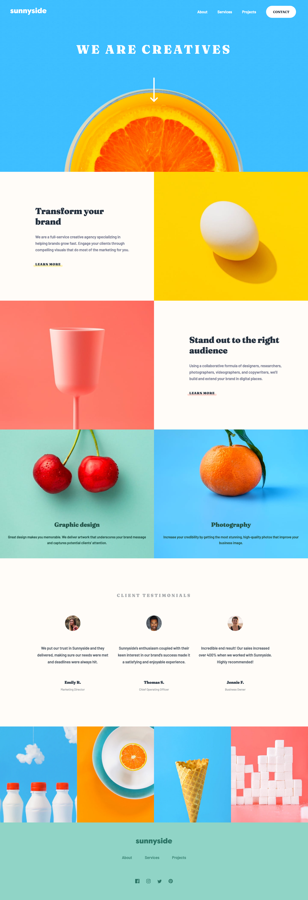

# Sunnyside agency landing page solution

This is a solution to the [Sunnyside agency landing page challenge on Frontend Mentor](https://www.frontendmentor.io/challenges/sunnyside-agency-landing-page-7yVs3B6ef). Frontend Mentor challenges help you improve your coding skills by building realistic projects.

Welcome to the "Sunnyside Agency Landing Page" challenge from Frontend Mentor. This project showcases a landing page for a creative agency, built using HTML for structure, CSS/Sass for styling, and JavaScript to handle the functionality of opening the mobile navigation.

## Links and Preview

| [Live Demo URL](https://ionstici.github.io/sunnyside-agency-landing-page) | [Frontend Mentor](https://www.frontendmentor.io/solutions/sunnyside-agency-landing-page-cuzM7Sz3rd) |
| ------------------------------------------------------------------------- | --------------------------------------------------------------------------------------------------- |

<b>Open Preview Image</b>

 

 

## Tech Stack

-   **HTML5:** For the semantic structure of the landing page.
-   **CSS3 with Sass:** For styling, making use of Sass features like variables and nesting for cleaner code.
-   **JavaScript:** To manage the mobile navigation toggle, ensuring a smooth user experience on mobile devices.
